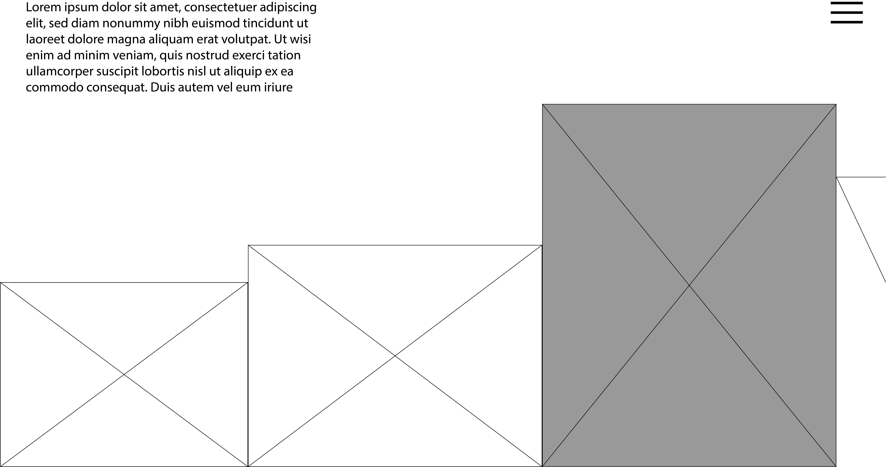

## Concept / Theme 

For my final, I will create a digital portfolio for my artwork designed as an interactive gallery experience. As users scroll, each piece will animate into view alongside accompanying text that explains the work. The scrolling will transition content from left to right, and this horizontal movement will also be triggered when the cursor is placed toward the right side of the screen.

Hovering over an artwork will reveal the piece in greater detail, along with relevant descriptive text. The experience will be smooth and responsive, with both the text and artwork adjusting in size depending on the content. This website will serve as an immersive and visually engaging way to explore my art and the concepts behind it.

## Visual and UX Inspiration 

https://www.studioahead.com/

## HTML/CSS/JS

- Event Listeners
- CSS Transitions & Animations
- Responsive Design
- Positioning & Flexbox/Grid
- Custom Cursor Effects

## Wireframe

This would be the homepage 

With hovering over an image 

About me page 

