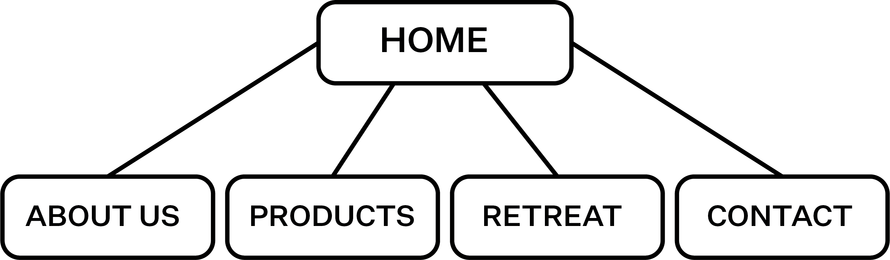

## Midterm Proposal

### Concept / Theme 

For one of my classes, I am developing a suite of assets for an identity project around a brand. The brand that I made is called Soleil. Soleil is an online store that curates products designed to foster continuous health and harmony. Their line includes natural and organic skin care products, home atmosphere accessories, and yoga and meditation accessories. Soleil also offers a wellness retreat that combines yoga, spa treatments, and rituals. Thus, the concept of the midterm is to create a website for this brand. I want it to be very clean and have interactive features. 

[Inspiring Website](https://www.studioahead.com/)

### Skills I've Learned 
>- boxes
>- padding, margin, border
>- alignment 

### Skills I Want to Learn 

>- how to use font that i have downloaded on my computer 
>- the scroll on the inspiring website 
>- how to add an animation to the website - how to make the animation move as the user scrolls 

### Sitemap 

